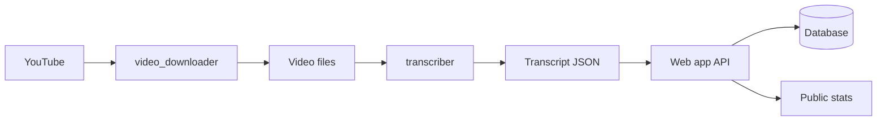

# Architecture

## Overview

This document describes the architecture and design decisions for the Debate Analyzer project. For **deployment architecture on AWS** (Batch + Web app stacks), see [ARCHITECTURE_AWS.md](ARCHITECTURE_AWS.md).

## Project Structure

### Source Code (`/src`)

All application source code resides in `/src/debate_analyzer/`. This follows Python packaging best practices and keeps the project organized.

```
src/
└── debate_analyzer/
    ├── __init__.py
    ├── conf/                    # Configuration files
    │   ├── video_downloader_conf.json
    │   └── transcriber_conf.json
    ├── video_downloader/        # YouTube download (yt-dlp)
    │   ├── __init__.py, __main__.py, cli.py, downloader.py
    ├── transcriber/             # Speech-to-text + speaker diarization
    │   ├── __init__.py, __main__.py, cli.py, transcriber.py
    │   ├── audio_extractor.py, diarizer.py, merger.py, models.py
    ├── db/                      # Web app: DB models and repository
    │   ├── base.py, models.py, repository.py
    └── api/                     # Web app: FastAPI, auth, loader
        ├── app.py, auth.py, loader.py, __main__.py
        └── static/              # Admin and public UI (HTML)
```

### Tests (`/tests`)

Tests are at the root-level `/tests` folder (standard Python convention):

- Clear separation between source and test code
- Easy test discovery by pytest
- Mirror structure of `src/debate_analyzer/` where useful

### Documentation (`/doc`)

Detailed documentation lives in `/doc`:

- [ARCHITECTURE_AWS.md](ARCHITECTURE_AWS.md) — AWS deployment architecture
- [AWS_SETUP.md](AWS_SETUP.md) — Step-by-step AWS setup
- [WEBAPP.md](WEBAPP.md) — Web app and run locally
- [TRANSCRIBE.md](TRANSCRIBE.md) — Transcribe module
- [HOWTO.md](HOWTO.md) — How-to guides
- [DEVELOPMENT.md](DEVELOPMENT.md) — Development workflow
- [API.md](API.md) — API reference
- [DEPLOYMENT_AWS_BATCH.md](DEPLOYMENT_AWS_BATCH.md) — AWS Batch job submission

## Design Principles

1. **Separation of Concerns**: Business logic (download, transcribe), data (db, models), and API (api) are separate.
2. **Type Safety**: Type hints throughout; mypy in CI.
3. **Testability**: Pytest in `/tests`; fixtures and clear boundaries.
4. **Documentation**: Public APIs and modules documented; detailed docs in `/doc`.

## Technology Stack

- **Python**: 3.9+
- **Package Manager**: Poetry (extras: `transcribe`, `webapp`)
- **Testing**: pytest, pytest-cov
- **Code Quality**: black, ruff, mypy
- **Build**: Poetry + Make

## Data Flow

1. **Download**: YouTube URL → `video_downloader` → local video + subtitles (or, on AWS Batch, upload to S3).
2. **Transcribe**: Video (local or S3) → `transcriber` (Whisper + pyannote) → JSON transcript (local or S3). See [TRANSCRIBE.md](TRANSCRIBE.md).
3. **Web app**: Register transcript (S3 or local URI) → DB; annotate speakers (map speaker IDs to profiles) → public speaker list and statistics. See [WEBAPP.md](WEBAPP.md).



## External Dependencies

- **yt-dlp**: Video download (video_downloader).
- **faster-whisper**: Speech-to-text (transcriber).
- **pyannote.audio**: Speaker diarization (transcriber); requires HuggingFace token and model terms.
- **FastAPI / Uvicorn**: Web app API and server.
- **SQLAlchemy**: DB access for web app; SQLite locally, PostgreSQL on AWS.

## See Also

- [ARCHITECTURE_AWS.md](ARCHITECTURE_AWS.md) — AWS deployment (Batch + Web app stacks)
- [AWS_SETUP.md](AWS_SETUP.md) — AWS setup guide
- [TRANSCRIBE.md](TRANSCRIBE.md) — Transcribe module
- [WEBAPP.md](WEBAPP.md) — Web app and local run
- [API.md](API.md) — API reference
