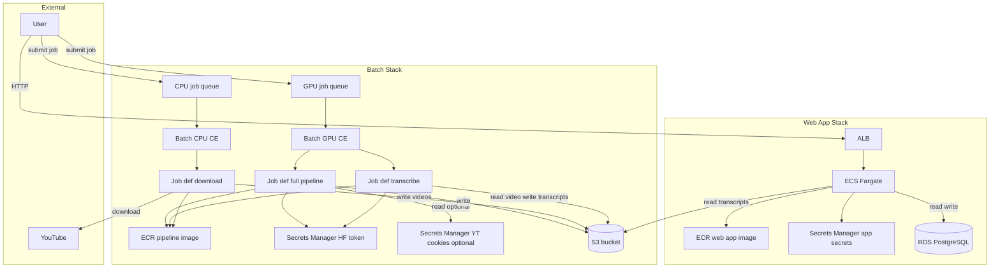

# AWS Deployment Architecture

This document describes the deployment architecture of Debate Analyzer on AWS: two Terraform stacks (Batch pipeline and Web app), their components, and how data flows between them.

For step-by-step setup and variable definitions, see [AWS_SETUP.md](AWS_SETUP.md). For job submission and two-job flow, see [DEPLOYMENT_AWS_BATCH.md](DEPLOYMENT_AWS_BATCH.md).

---

## Overview

- **Two Terraform stacks**, with **separate state**:
  - **Batch stack** (`deploy/terraform/`): S3, ECR (pipeline image), Secrets Manager (HuggingFace token, optional YouTube cookies), AWS Batch (GPU and CPU compute environments, job queues, job definitions), CloudWatch logs.
  - **Web app stack** (`deploy/terraform-webapp/`): ECR (web app image), Secrets Manager (app secrets), RDS PostgreSQL, ECS Fargate, Application Load Balancer.
- **Order:** Apply the Batch stack first. The web app stack requires the **S3 bucket name** from the Batch stack (same bucket holds transcripts; web app reads from it).
- **Single S3 bucket:** All job outputs (videos, transcripts) live in the bucket created by the Batch stack. The web app is given read-only access to that bucket via `existing_s3_bucket_name`.

---

## Batch Stack (Pipeline: Download + Transcribe)

| Component | Purpose |
|-----------|---------|
| **Secrets Manager** | HuggingFace token (required for pyannote); optional YouTube cookies (from file or ARN) for bot check. |
| **S3 bucket** | `debate-analyzer-<account_id>`. Prefixes: `jobs/<job-id>/videos/` (downloaded video files), `jobs/<job-id>/subtitles/` (downloaded subtitles), `jobs/<job-id>/transcripts/` (transcription JSON, optional audio). |
| **IAM** | Job role (S3 read/write, Secrets Manager read); execution role (ECR pull, CloudWatch Logs, Secrets Manager read); instance role for Batch EC2 hosts. |
| **ECR** | Repository for the **pipeline** Docker image (built from repo root `Dockerfile`; tag e.g. `latest`). Pushed by CI or manually. |
| **VPC** | Default or custom (`vpc_id`, `subnet_ids`). Security group for Batch compute: egress only (no inbound). |
| **Batch compute environments** | **GPU** (e.g. g4dn.xlarge, ECS_AL2023_NVIDIA): full-pipeline and transcribe-only jobs. **CPU** (e.g. c5.xlarge): download-only jobs. Both scale to zero when idle (min vCPUs = 0). |
| **Batch job queues** | GPU queue (priority for full-pipeline and transcribe job); CPU queue (download job). |
| **Batch job definitions** | Full-pipeline (GPU; VIDEO_URL + OUTPUT_S3_PREFIX); download-only (CPU; no HF token); transcribe-only (GPU; VIDEO_S3_PREFIX + OUTPUT_S3_PREFIX; HF token injected). |
| **CloudWatch** | Log group for Batch job container logs (e.g. `/aws/batch/debate-analyzer`). |

**Data flow (Batch):** User submits job with `VIDEO_URL` and/or S3 prefix → Batch runs container → container reads `HF_TOKEN` (and optional YT cookies) from Secrets Manager → download and/or transcribe → writes videos/transcripts to S3 under `jobs/<job-id>/`.

---

## Web App Stack (ECS + RDS + ALB)

| Component | Purpose |
|-----------|---------|
| **Secrets Manager** | Single secret with `db_password`, `admin_username`, `admin_password`. ECS task definition injects these as env vars (DATABASE_URL is built from RDS endpoint + db_password). |
| **RDS** | PostgreSQL 15, single instance (e.g. db.t3.micro), private (not publicly accessible). DB subnet group and security group allow 5432 only from ECS tasks. |
| **ECR** | Separate repository for the **web app** image (built from `Dockerfile.webapp`; tag e.g. `latest`). Pushed by CI or manually. |
| **ECS** | Fargate cluster; task execution role (ECR pull, Secrets Manager read); task role (S3 read on existing Batch bucket); task definition (port 8000, DATABASE_URL, ADMIN_USERNAME, ADMIN_PASSWORD); service with desired_count 1, attached to ALB target group. |
| **ALB** | Application Load Balancer, HTTP:80; target group health check (e.g. `/api/speakers`). Security group allows 80 from 0.0.0.0/0; ECS tasks allow 8000 only from ALB. |
| **VPC** | Same region; default or custom VPC/subnets (can match Batch stack for simplicity). |

**Data flow (Web app):** User → ALB (HTTP 80) → ECS Fargate (FastAPI app on 8000). App reads transcripts from S3 (bucket from Batch stack), reads/writes speaker profiles and metadata in RDS.

---

## Architecture Diagram

---

## S3 Layout (Single Bucket from Batch Stack)

| Prefix | Purpose | Written by | Read by |
|--------|---------|------------|---------|
| `jobs/<job-id>/videos/` | Downloaded video files (directly under this prefix, e.g. `<filename>.mp4`) | Download job or full-pipeline job | Transcribe job (if two-job flow); optional manual use |
| `jobs/<job-id>/subtitles/` | Downloaded subtitle files (e.g. `.srt`) | Download job or full-pipeline job | Optional manual use |
| `jobs/<job-id>/transcripts/` | Transcription JSON (and optionally audio) | Transcribe job or full-pipeline job | Web app (register transcript by S3 URI) |

The web app stack does **not** create a new bucket; it uses `existing_s3_bucket_name` to grant the ECS task role read access to this bucket.

---

## References

- [AWS_SETUP.md](AWS_SETUP.md) — Step-by-step setup and all Terraform variables.
- [DEPLOYMENT_AWS_BATCH.md](DEPLOYMENT_AWS_BATCH.md) — Job submission, two-job flow, YouTube cookies, logs.
- [deploy/terraform/README.md](../deploy/terraform/README.md) — Batch stack quick reference.
- [deploy/terraform-webapp/README.md](../deploy/terraform-webapp/README.md) — Web app stack quick reference.
