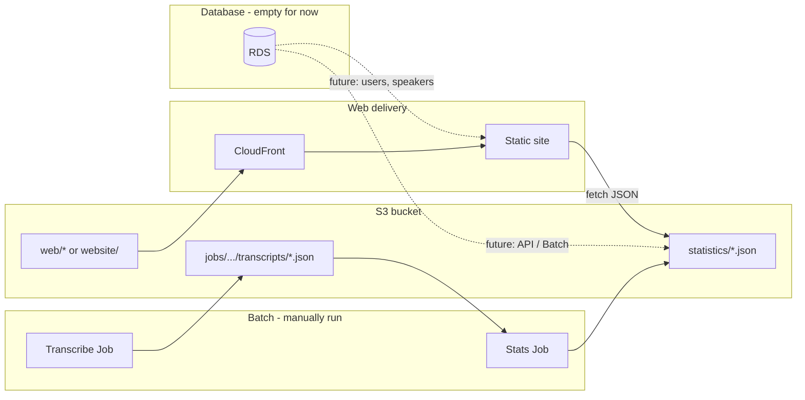

# AWS stats web infra – build plan

Plan for AWS infrastructure and components for a hosted statistics web app: pre-computed transcript statistics from manually run AWS Batch jobs (S3), static web (S3 + CloudFront), and an empty RDS database for future use (users, speakers, cross-transcript aggregation). Schema to be defined later.

**Decisions locked in:** Database = RDS (Postgres or MySQL). Stats job input = manifest/list of job IDs or S3 paths. Web = static site (S3 + CloudFront).

---

# AWS-hosted statistics web and Batch stats jobs

## Context

- **Transcripts** today: produced by existing AWS Batch (download + transcribe); stored at `s3://<bucket>/jobs/<job-id>/transcripts/*.json`. Each JSON has `duration`, `speakers_count`, `transcription` (array of `{start, end, text, speaker, confidence}`).
- **No stats yet**: There is no statistics module; [HOWTO.md](HOWTO.md) only shows ad-hoc examples (words per speaker, speaking time). No existing web app or API.
- **Existing AWS**: Terraform in [deploy/terraform/](../deploy/terraform/) provisions one S3 bucket, ECR, Batch (GPU + CPU queues), job definitions for full-pipeline, download-only, and transcribe-only. Same bucket and IAM are reused for stats and web assets.

---

## Architecture overview

- **Input for stats**: Transcript JSONs under `jobs/<job-id>/transcripts/` (existing).
- **Output of stats job**: Pre-computed statistics under a fixed prefix, e.g. `statistics/`, in the **same** S3 bucket (no new bucket).
- **Web**: Static site (HTML/JS or SPA) served via **S3 + CloudFront**, reading statistics JSON from S3 (or via a small Lambda if you want caching/auth later).

---

## 1. S3 layout (same bucket)

Use the existing bucket from `deploy/terraform/main.tf` (`aws_s3_bucket.output`). Define a clear layout:

| Prefix                       | Purpose                    | Written by          | Read by      |
| ---------------------------- | -------------------------- | ------------------- | ------------ |
| `jobs/<job-id>/videos/`      | Videos (existing)          | Download job        | -            |
| `jobs/<job-id>/transcripts/` | Transcript JSON (existing) | Transcribe job      | Stats job    |
| `statistics/`                | Pre-computed stats         | Stats Batch job     | Web (or API) |
| `website/` or `web/`         | Static web app assets      | CI or manual upload | CloudFront   |

**Statistics schema (under `statistics/`):**

- **Option A – single aggregate:** `statistics/summary.json` (e.g. list of "runs" or "video" summaries + global aggregates). Stats job overwrites or versioned by run.
- **Option B – per-video + index:** `statistics/index.json` (list of job IDs or video keys with metadata), `statistics/by-job/<job-id>.json` per transcript. Stats job adds/updates files; web loads index then fetches per-video JSON as needed.
- **Recommendation:** Start with Option B for flexibility (per-video stats + one index); add a single `summary.json` if you want dashboard totals without loading every file.

No Terraform change required for S3 layout; the existing job role already has `s3:GetObject`, `s3:PutObject`, `s3:ListBucket` on the whole bucket, so `statistics/*` is allowed.

---

## 2. Individual components

### 2.1 Statistics computation (Python module + Batch job)

- **Where:** New package under `src/debate_analyzer/` (e.g. `stats/` or `analytics/`).
- **Responsibilities:**
  - Load transcript JSON(s) (from local path or S3).
  - Compute metrics (e.g. words per speaker, speaking time per speaker, segment count, confidence stats, optional cross-video aggregates).
  - Output JSON matching a small, documented schema for the web.
- **Batch:** New **CPU-only** job definition + entrypoint (reuse existing CPU queue).
  - **Entrypoint (e.g. `entrypoint_stats.sh`):**
    - **Input: manifest/list** – the job takes a manifest (e.g. JSON file in S3 or env var) listing which transcript job IDs or S3 paths to include (e.g. `["job-id-1", "job-id-2"]` or list of `s3://bucket/jobs/<id>/transcripts/` prefixes). No scanning of the whole bucket; only transcripts listed in the manifest are downloaded and processed.
    - Env vars: e.g. `MANIFEST_S3_URI` (S3 URI of manifest file) or `JOB_IDS` (comma-separated), and `STATS_OUTPUT_S3_URI` (e.g. `s3://bucket/statistics/`).
    - Entrypoint fetches manifest, downloads only those transcript JSONs, runs the Python stats module, uploads results to `statistics/`.
  - **Image:** Reuse the same ECR image (add the stats module and the new entrypoint to the Dockerfile); no GPU needed, so the stats job uses the **CPU queue** and a new job definition with only CPU/memory.
- **Run:** Manually submitted (e.g. `submit-stats-job.sh` with manifest URI or job ID list and `STATS_OUTPUT_S3_URI`), no scheduler.

Deliverables:

- `src/debate_analyzer/stats/` (or `analytics/`): module with type hints, docstrings, and a small CLI or callable that reads N transcript files and writes the chosen JSON schema.
- `deploy/scripts/entrypoints/entrypoint_stats.sh`: script as above.
- Terraform: new Batch job definition (CPU, same image, command = `entrypoint_stats.sh`); optional new output for queue/definition name.
- `deploy/scripts/submit-jobs/submit-stats-job.sh`: wrapper to submit the job with manifest URI or job ID list and `STATS_OUTPUT_S3_URI`.

### 2.2 Pre-computed statistics storage (S3)

- **Where:** Same bucket, prefix `statistics/`.
- **Written by:** Stats Batch job (Python + entrypoint above).
- **Schema:** Define a minimal JSON schema (e.g. `statistics/schema.json` or in `doc/`) so the web and the job stay in sync (e.g. `index.json` with `{ "jobs": [ { "jobId", "videoLabel?", "updatedAt" } ] }`, and `by-job/<id>.json` with per-speaker/per-video metrics).

No new Terraform resource; optional: S3 bucket lifecycle or versioning for `statistics/` if you want history (can be added later).

### 2.3 Web frontend (static site)

- **Content:** HTML/CSS/JS (or a small SPA – React/Vue/etc.) that:
  - Fetches statistics JSON from a known URL (S3 via CloudFront, or via a Lambda URL – see below).
  - Renders tables/charts (e.g. speaking time per speaker, words per speaker, per-video list, totals).
- **Hosting:** Static assets in S3 under a dedicated prefix (e.g. `website/`) and served via **CloudFront** with that S3 bucket as origin (and optionally a second origin for `statistics/` or serve stats from the same bucket with path-based behavior).
- **Access to stats JSON:**
  - **Option A (simplest):** CloudFront origin = S3 bucket; allow public read on `website/*` and `statistics/*` (bucket policy or OAC). Frontend fetches `https://<cloudfront-domain>/statistics/index.json` etc.
  - **Option B:** Lambda@Edge or Lambda function URL that reads from S3 and returns JSON (allows caching, auth, or CORS without opening the bucket).
  Start with Option A; add Lambda only if you need auth or stricter control.

Deliverables:

- **Repo:** New directory for the web app, e.g. `web/` or `frontend/` at repo root (or under `deploy/` if you prefer). Contains index.html, assets, and JS that loads the statistics schema.
- **Terraform:**
  - S3 bucket policy (or OAC) so CloudFront can read `website/` and `statistics/`.
  - CloudFront distribution: origin = S3 (or two origins: one for `website/`, one for `statistics/` if you want different cache rules).
  - Optional: custom domain + ACM certificate if you want a real domain.

### 2.4 Database (provisioned empty; structure later)

- **Choice: relational (RDS).** Provision RDS (Postgres or MySQL) only; no DynamoDB.
- **Purpose:** Reserve a database for future use: user accounts, speakers database, transcript/session metadata, and aggregated stats (cross-transcript queries). Schema and tables are **not** defined in this plan; only the DB resource is provisioned.
- **Terraform:** New resources in `deploy/terraform/`: RDS instance (Postgres or MySQL, in VPC used by Batch), security group (ingress from Batch/API only if needed later), subnet group, and Secrets Manager secret for DB credentials. Default database name (e.g. `debate_analyzer`). No tables or migrations in this phase. Outputs: RDS endpoint and secret ARN for credentials.
- **IAM:** No application roles yet; when you add an API or Batch job that uses the DB, grant that role access to the secret and allow network path to the instance. Optional: create a minimal IAM policy for "future API role" that can read the DB secret.
- **Explicitly out of scope for now:** Table definitions, migrations, application code that connects to the DB, or any schema. Those are defined later once you decide on users, speakers, and aggregation needs.

Deliverables:

- Terraform: RDS instance (Postgres or MySQL) + secret for credentials; security group; outputs.
- Doc: Short note in `doc/` that the DB exists, is empty, and that schema/structure will be defined later.

### 2.5 CI / deployment of the web app

- **Build:** Either build the static site in CI (e.g. `npm run build`) or commit pre-built assets.
- **Deploy:** Upload build output to `s3://<bucket>/website/` and invalidate CloudFront cache for `/*` (or `/website/*`). Can be a GitHub Actions step (reuse same AWS creds as ECR push) or a small script `deploy/scripts/deploy-web.sh` that runs after `terraform output`.

### 2.6 AWS infrastructure (Terraform) – summary

| Component              | Action                                                                                                                                      |
| ---------------------- | ------------------------------------------------------------------------------------------------------------------------------------------- |
| S3 bucket              | Reuse existing; no new bucket.                                                                                                              |
| S3 layout              | Convention only: `statistics/`, `website/`.                                                                                                 |
| IAM (Batch job role)   | No change (already has S3 read/write on bucket).                                                                                            |
| Batch CPU queue        | Reuse existing `batch_job_queue_cpu_name`.                                                                                                  |
| Batch job definition   | **New:** stats job (CPU, same ECR image, command = `entrypoint_stats.sh`).                                                                   |
| CloudFront             | **New:** distribution, origin = S3; optional second origin for stats path.                                                                  |
| S3 bucket policy / OAC | **New:** allow CloudFront to read `website/` and `statistics/`.                                                                              |
| **Database**           | **New:** RDS (Postgres or MySQL) only; **empty** – no schema/tables defined; credentials in Secrets Manager; structure to be defined later.  |
| Optional               | ACM cert + custom domain; Lambda for stats API.                                                                                              |

---

## 3. Data flow (stats job)

1. You prepare a **manifest** (list of job IDs or S3 paths to include) and upload it to S3 or pass it via env (e.g. `MANIFEST_S3_URI=s3://<bucket>/manifests/run-1.json` or `JOB_IDS=id1,id2`).
2. You run the stats job (manually) with `MANIFEST_S3_URI` (or `JOB_IDS`) and `STATS_OUTPUT_S3_URI=s3://<bucket>/statistics`.
3. Entrypoint fetches the manifest, resolves which transcript JSONs to use (e.g. `s3://bucket/jobs/<id>/transcripts/*.json` per id), downloads only those files into the container.
4. Python stats module aggregates and produces e.g. `index.json` + `by-job/<id>.json`.
5. Entrypoint uploads results to `statistics/`.
6. Web app (via CloudFront) loads `statistics/index.json` and then `statistics/by-job/<id>.json` as needed.

---

## 4. Implementation order

1. **Database (empty)** – Terraform: provision RDS (Postgres or MySQL); store credentials in Secrets Manager; no tables/schema. Document in `doc/` that DB is empty and structure will be defined later.
2. **Statistics module** – Implement `src/debate_analyzer/stats/` (schema + computation), unit tests, and CLI or callable used by the entrypoint.
3. **Stats entrypoint + job definition** – Add `entrypoint_stats.sh` (manifest-based input), extend Dockerfile, add Terraform job definition (CPU), add `submit-stats-job.sh` (accept manifest URI or job ID list).
4. **S3 convention** – Document `statistics/` schema and layout in `doc/` (and optionally add `statistics/schema.json`).
5. **Web app** – Implement minimal static site in `web/` that consumes the statistics JSON and renders key metrics.
6. **CloudFront + S3 for web** – Terraform: CloudFront, S3 bucket policy/OAC, outputs (CloudFront URL, optional domain).
7. **CI** – Add job to build and upload web assets and invalidate CloudFront (or document manual `deploy-web.sh`).

---

## 5. Security and cost notes

- **Credentials:** No new secrets; stats job uses existing Batch job role (S3 + optional Secrets Manager if you ever need it).
- **Public read:** Only the chosen S3 prefixes (`website/*`, `statistics/*`) need to be readable by CloudFront (and thus by the browser). Rest of bucket stays private.
- **Cost:** CloudFront + S3 read for a small stats site is low; Batch runs only when you submit the stats job (CPU, scale-to-zero when idle).

---

## 6. Open choices (for you to decide)

- **Exact statistics:** Which metrics to compute first (e.g. words per speaker, speaking time, segment count, confidence distribution, per-video vs global). The HOWTO examples give a good baseline; the plan above assumes at least per-video and per-speaker aggregates.
- **Web stack:** Vanilla JS vs React/Vue (vanilla is enough for a first version that loads a few JSON files and renders tables/charts with a small library). Web = static site (S3 + CloudFront) as described.
- **Custom domain:** Plan uses CloudFront default domain; add ACM + alias if you want a dedicated domain.

This plan reuses your existing bucket, Batch CPU queue, and IAM; adds a stats Batch job, a statistics prefix, a static web app, CloudFront, and an **empty provisioned database** (structure defined later) so you can present pre-computed statistics from manually run AWS Batch jobs and later add users, speakers, and cross-transcript aggregation.
