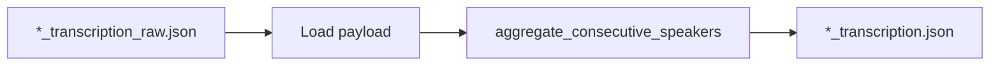

# Transcription quality and transcript post-processing (updated plan)

## Naming convention

- **`*_transcription_raw.json`** — Output of the **transcription job only** (Whisper + diarization + merge). Merge-only segments; no consecutive-speaker aggregation in the transcriber. Aggregation into blocks is done only in the postprocess job.
- **`*_transcription.json`** — **Canonical transcript**: output of the **transcript postprocess job**, which reads raw and writes here. LLM postprocessing is not part of this job; the job only aggregates consecutive same-speaker segments into blocks (with uid, aggregated start/end, concatenated text). Downstream jobs (LLM analysis, stats, webapp registration) use this file.

So: transcribe → `*_transcription_raw.json`; then postprocess job reads raw, aggregates into blocks, and writes `*_transcription.json`. The canonical transcript is produced by aggregation only (no LLM correction).

---

## 1. Transcription quality (config and docs)

**Current state:** [transcriber_conf.json](src/debate_analyzer/conf/transcriber_conf.json) uses `language: null`, `beam_size: 1`. The CLI already supports `--language` and `--model-size`; config is loaded in [transcriber.py](src/debate_analyzer/transcriber/transcriber.py).

**Changes:**

- **Config:** In `transcriber_conf.json`, set `"language": "cs"`, `"beam_size": 5`.
- **Transcriber output filename:** In [transcriber.py](src/debate_analyzer/transcriber/transcriber.py), change the written file from `{stem}_transcription.json` to **`{stem}_transcription_raw.json`** (e.g. line 354: `output_filename = f"{video_path.stem}_transcription_raw.json"`).
- **Docs:** In [doc/TRANSCRIBE.md](doc/TRANSCRIBE.md) and optionally [doc/HOWTO.md](doc/HOWTO.md), document:
  - Default config targets Czech and `beam_size: 5`; for other languages use `--language XX` or `language: null` for auto-detect.
  - Output of the transcriber is `*_transcription_raw.json`; the canonical `*_transcription.json` is produced by the transcript postprocess job (aggregation of consecutive same-speaker segments into blocks; no LLM correction).

---

## 2. Transcript postprocess job (aggregation only; no LLM)

**Goal:** The transcript postprocess job reads `*_transcription_raw.json`, **aggregates consecutive same-speaker segments into one block per speaker run**, and writes **`*_transcription.json`** (canonical transcript). LLM postprocessing (grammar/ASR error correction) is not part of this job.

**Data flow:**



**Design:**

- **Input:** `*_transcription_raw.json` (from transcriber). Reuse [load_transcript_payload](src/debate_analyzer/api/loader.py).
- **Output:** **`*_transcription.json`** — same directory/prefix as input. The `transcription` list contains **blocks** (not raw segments): each block has `start` (min of segment starts in the run), `end` (max of segment ends), `text` (concatenation of segment texts with a space), `speaker`, and `uid` (new unique id per block). Optionally `confidence` (average of merged segments when present).
- **Implementation:** [transcript_postprocess.py](src/debate_analyzer/analysis/transcript_postprocess.py) provides `aggregate_consecutive_speakers(segments)`; [transcript_postprocess_job.py](src/debate_analyzer/batch/transcript_postprocess_job.py) loads raw, calls aggregation, writes result (no LLM backend).
- **Docs:** Transcriber writes raw; postprocess job writes canonical `*_transcription.json` with blocks; downstream uses `*_transcription.json`.


---

## 3. Downstream and backward compatibility

- **LLM analysis job,** **stats job,** **loader,** **webapp,** **deploy scripts:** They already expect and list `*_transcription.json`. No change needed: they will now get the aggregated (block-level) transcript when the full pipeline (transcribe + post-process) has been run.
- **When only transcribe is run:** Only `*_transcription_raw.json` exists. To run analysis or stats, either:
  - Run the post-process job first (so that `*_transcription.json` is created), or
  - Temporarily treat `*_transcription_raw.json` as the transcript (e.g. pass its URI to the analysis job if we add support for “use raw as transcript” for testing). Plan assumes normal flow is: transcribe → post-process → analysis, so canonical input to analysis is `*_transcription.json`.
- **Existing data:** Transcripts already named `*_transcription.json` (before this change) remain valid; they are “raw” in content. Optional migration or doc note: renaming old files to `*_transcription_raw.json` and running post-process produces new `*_transcription.json`. Not required for code.

---

## 4. Summary

| Output | Producer | Consumer |
|--------|----------|----------|
| `*_transcription_raw.json` | Transcriber only | Transcript postprocess job (input) |
| `*_transcription.json` | Transcript postprocess job (aggregation only; or, if skipped, copy raw → transcription; see below) | LLM analysis, stats, webapp, deploy |

**Optional (skip post-processing):** If you do not run the postprocess job, add to the docs (e.g. [doc/TRANSCRIBE.md](doc/TRANSCRIBE.md) or [doc/DEPLOYMENT_AWS_BATCH.md](doc/DEPLOYMENT_AWS_BATCH.md)) a short subsection that explains how to use the raw transcript as the canonical one by copying in S3. Include an AWS CLI example:

- **Single file:**  
  `aws s3 cp s3://BUCKET/PREFIX/stem_transcription_raw.json s3://BUCKET/PREFIX/stem_transcription.json`
- **All raw files under a prefix (bash):**  
  List objects with suffix `_transcription_raw.json`, then for each run `aws s3 cp` from `key` to `key` with `_transcription_raw.json` replaced by `_transcription.json`. Example one-liner (replace BUCKET and PREFIX):
  ```bash
  aws s3 ls s3://BUCKET/PREFIX/ --recursive | awk '/_transcription_raw\.json$/ {print $4}' | while read key; do
    new_key="${key%_transcription_raw.json}_transcription.json"
    aws s3 cp "s3://BUCKET/$key" "s3://BUCKET/$new_key"
  done
  ```

This gives users a documented way to get `*_transcription.json` in place when they skip the postprocess job.
