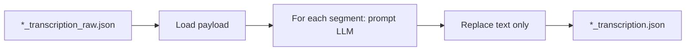

# Transcription quality and LLM post-processing (updated plan)

## Naming convention

- **`*_transcription_raw.json`** — Output of the **transcription job only** (Whisper + diarization + aggregation). No LLM correction.
- **`*_transcription.json`** — **Canonical transcript**: output of the **full pipeline** when LLM correction is run (i.e. post-process reads raw and writes here). Downstream jobs (LLM analysis, stats, webapp registration) use this file.

So: transcribe → `*_transcription_raw.json`; then LLM post-process reads raw and writes `*_transcription.json`. The “whole job” (transcribe + correction) produces `*_transcription.json`.

---

## 1. Transcription quality (config and docs)

**Current state:** [transcriber_conf.json](src/debate_analyzer/conf/transcriber_conf.json) uses `language: null`, `beam_size: 1`. The CLI already supports `--language` and `--model-size`; config is loaded in [transcriber.py](src/debate_analyzer/transcriber/transcriber.py).

**Changes:**

- **Config:** In `transcriber_conf.json`, set `"language": "cs"`, `"beam_size": 5`.
- **Transcriber output filename:** In [transcriber.py](src/debate_analyzer/transcriber/transcriber.py), change the written file from `{stem}_transcription.json` to **`{stem}_transcription_raw.json`** (e.g. line 354: `output_filename = f"{video_path.stem}_transcription_raw.json"`).
- **Docs:** In [doc/TRANSCRIBE.md](doc/TRANSCRIBE.md) and optionally [doc/HOWTO.md](doc/HOWTO.md), document:
  - Default config targets Czech and `beam_size: 5`; for other languages use `--language XX` or `language: null` for auto-detect.
  - Output of the transcriber is `*_transcription_raw.json`; the canonical `*_transcription.json` is produced by the full pipeline (transcribe + LLM correction).

---

## 2. LLM post-processing of transcript segments

**Goal:** Optional step that reads `*_transcription_raw.json`, corrects only the `text` field of each segment via the same LLM backends as analysis, and writes **`*_transcription.json`** (canonical transcript). Downstream jobs keep using `*_transcription.json` unchanged.

**Data flow:**

**Design:**

- **Input:** `*_transcription_raw.json` (from transcriber). Reuse [load_transcript_payload](src/debate_analyzer/api/loader.py).
- **Output:** **`*_transcription.json`** — same directory/prefix as input, same structure; only segment `text` fields updated. Add e.g. `"model": {..., "postprocess": "ollama/..."}` for traceability.
- **Backend:** Same as [llm_analysis_job.py](src/debate_analyzer/batch/llm_analysis_job.py): `MOCK_LLM=1` or Ollama via `get_ollama_backend()` and `generate_batch`.
- **Prompt:** One prompt per segment. **Critical constraint:** the prompt must explicitly instruct the model to fix **only grammar and obvious transcription (ASR) errors**; **do not change meaning, wording, or content**. E.g. correct typos, verb agreement, punctuation, and clear speech-to-text mishears (e.g. homophones); do not paraphrase, add, remove, or reinterpret. New constant in [prompts.py](src/debate_analyzer/analysis/prompts.py); wording should stress “grammar and transcription errors only, no meaning change”.
- **Batching:** `generate_batch` over segment prompts; cap per-segment token length if needed; on empty/invalid response keep original `text`.
- **Preserve:** `start`, `end`, `speaker`, `confidence` unchanged.

**Prompt wording (correction step):** The LLM prompt for post-processing **must** stress:
- **Only** fix grammar errors and obvious transcription (ASR) errors (e.g. typos, homophones, punctuation).
- **Do not** change meaning, paraphrase, add, remove, or reinterpret content.
- Output **only** the corrected text, nothing else.

This keeps the transcript faithful to what was said while cleaning mechanical and ASR mistakes.

**Implementation:**

- New module (e.g. `transcript_postprocess.py` or small package) that: loads raw payload, builds prompts, calls `generate_batch`, maps responses to segments, writes result as `*_transcription.json` (derive path from input: replace `_transcription_raw.json` with `_transcription.json`).
- New batch/CLI entrypoint (e.g. `python -m debate_analyzer.batch.transcript_postprocess_job`) reading `TRANSCRIPT_S3_URI` (or path) pointing at a `*_transcription_raw.json`; optional `TRANSCRIPTS_S3_PREFIX` for multiple files.
- Unit tests with `MOCK_LLM=1`.
- Docs: when to use post-processing; that transcriber writes raw; post-process writes canonical `*_transcription.json`; downstream uses `*_transcription.json`.

---

## 3. Downstream and backward compatibility

- **LLM analysis job,** **stats job,** **loader,** **webapp,** **deploy scripts:** They already expect and list `*_transcription.json`. No change needed: they will now get the corrected transcript when the full pipeline (transcribe + post-process) has been run.
- **When only transcribe is run:** Only `*_transcription_raw.json` exists. To run analysis or stats, either:
  - Run the post-process job first (so that `*_transcription.json` is created), or
  - Temporarily treat `*_transcription_raw.json` as the transcript (e.g. pass its URI to the analysis job if we add support for “use raw as transcript” for testing). Plan assumes normal flow is: transcribe → post-process → analysis, so canonical input to analysis is `*_transcription.json`.
- **Existing data:** Transcripts already named `*_transcription.json` (before this change) remain valid; they are “raw” in content. Optional migration or doc note: renaming old files to `*_transcription_raw.json` and running post-process produces new `*_transcription.json`. Not required for code.

---

## 4. Summary

| Output | Producer | Consumer |
|--------|----------|----------|
| `*_transcription_raw.json` | Transcriber only | LLM post-process job (input) |
| `*_transcription.json` | LLM post-process (or, if skipped, could copy raw → transcription; see below) | LLM analysis, stats, webapp, deploy |

**Optional:** If post-processing is disabled or not run, the pipeline could copy `*_transcription_raw.json` to `*_transcription.json` so downstream always has one file to read. That can be a follow-up; the minimal plan is: transcriber writes raw; post-process reads raw and writes canonical; when post-process is used, analysis uses canonical.
